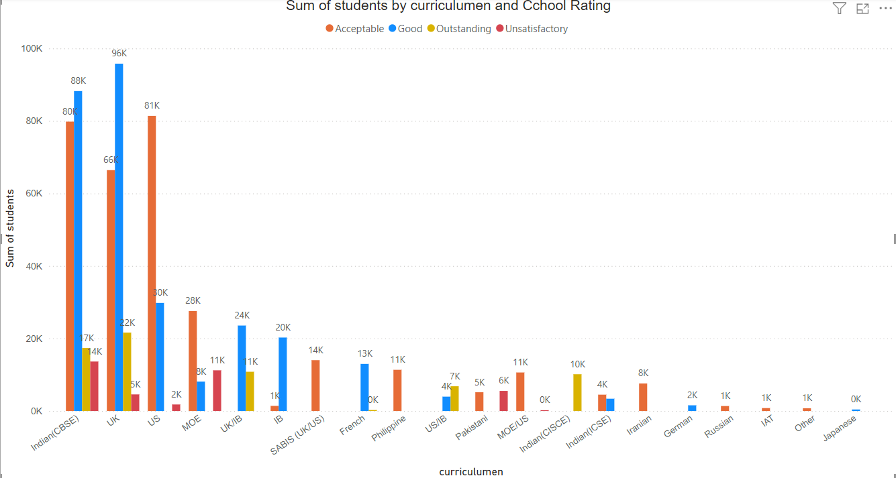
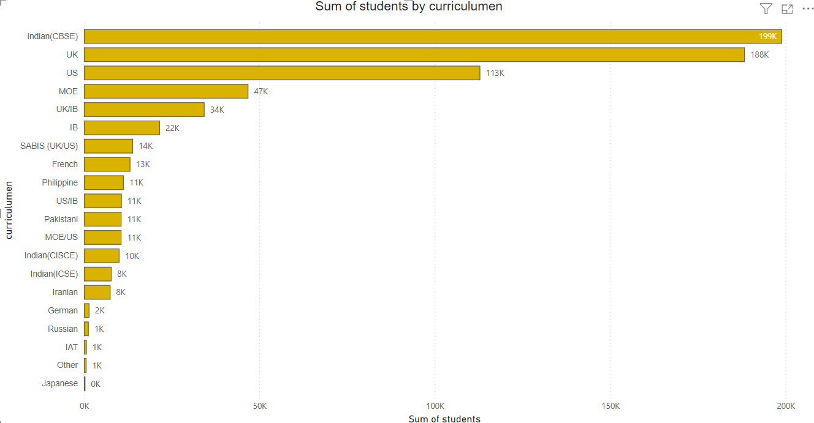
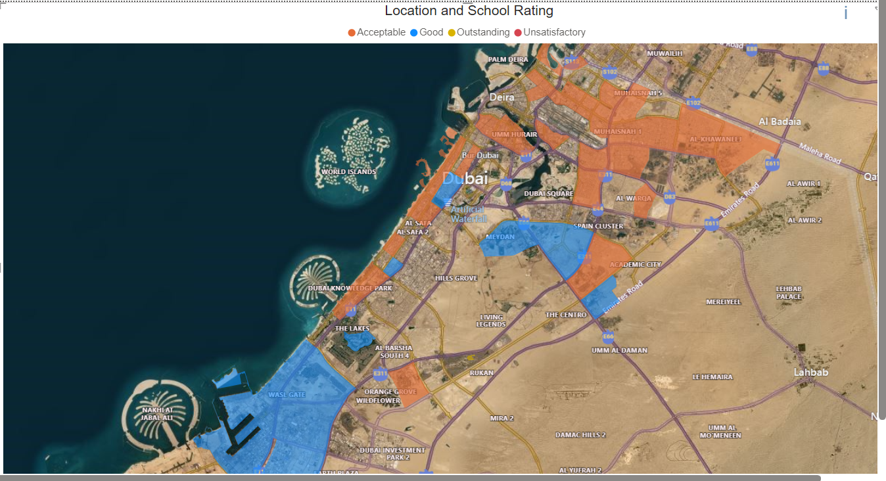
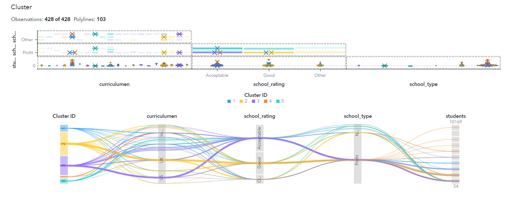
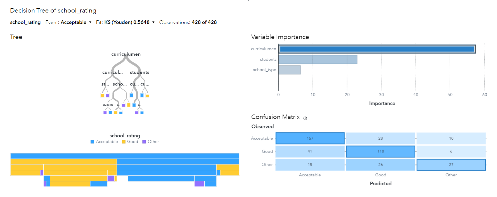

# Dubai School Performance Analytics


**Identifying Drivers of Educational Quality in Dubai's Private School Sector**

---

## 📊 Project Overview

An independent analytical study examining 200+ private schools in Dubai to understand what factors drive educational quality and performance. Using enterprise analytics tools and machine learning, this project reveals how curriculum type, enrollment size, and institutional structure influence school ratings.

**Timeline:** April - June 2025  
**Motivation:** As a Dubai resident and Business Analytics student, I wanted to apply data science to understand and improve the education system in my community.

---

## 🎯 Key Findings

### 🎓 Curriculum is the Strongest Performance Driver

<p align="center">
  
  <br>
  <em>Performance distribution across different curriculum types</em>
</p>

- Curriculum type accounts for **43.5% of predictive power** in determining school ratings
- **91% of UK, IB, and European curriculum schools** achieved "Good" or higher ratings
- Regional curriculum schools (MOE, Indian, Pakistani) showed more variable performance

---

### 📏 School Size Matters

<p align="center">
  
  <br>
  <em>Student enrollment distribution by curriculum type</em>
</p>

- Schools with **1,800+ students** consistently outperformed smaller institutions
- Economies of scale enable better resource allocation and specialized staff
- Indian and UK curriculum schools serve the largest student populations (180,000+ combined)

---

### 🗺️ Geographic Distribution & Inequality

<p align="center">
  
  <br>
  <em>Geographic distribution of schools across Dubai by KHDA rating</em>
</p>

**Key Observations:**
- **Central Dubai** (Business Bay, Marina, Downtown): Highest concentration of "Good" and "Outstanding" schools
- **Peripheral areas** (Al Warqaa, Mirdif): Predominantly "Acceptable" ratings
- Clear geographic disparity in access to high-quality education

---

### 🏫 Six Distinct School Profiles

<p align="center">
  
  <br>
  <em>Six distinct school clusters identified through K-means analysis</em>
</p>

Through K-means clustering, schools grouped into 6 distinct categories:

| Cluster | Profile | Avg Students | Curriculum | Rating Pattern |
|---------|---------|--------------|------------|----------------|
| 1 | Large Government Schools | 1,675 | MOE | Acceptable |
| 2 | Embassy/Specialty Schools | 510 | Various | Variable |
| 3 | Mainstream International | 1,284 | US | Acceptable |
| 4 | High-Capacity Indian | 2,999 | Indian | Acceptable |
| 5 | Traditional British | 1,213 | UK (Non-Profit) | Good |
| 6 | Premium British | 1,607 | UK (For-Profit) | Good-Outstanding |

---

## 🛠️ Methodology

### Decision Tree Model

<p align="center">
  
  <br>
  <em>Decision tree visualization showing curriculum as primary predictor</em>
</p>

**Model Performance:**
- Training Accuracy: **88%**
- Validation Accuracy: **81-87%**
- Top Predictor: Curriculum Type (**43.5% importance**)

**Key Decision Points:**
1. **First split:** International vs. Regional curricula
2. **Second split:** School size (1,928+ students threshold for UK curriculum)
3. **Terminal nodes:** Clear rating predictions with high confidence

### Analysis Pipeline
```
Data Collection (KHDA via Dubai Pulse)
         ↓
Data Cleaning & Preprocessing (Excel)
         ↓
Exploratory Visual Analysis (Power BI)
         ↓
Predictive Modeling (SAS Viya Decision Tree)
         ↓
Segmentation Analysis (SAS Viya K-Means Clustering)
         ↓
Insight Generation & Policy Recommendations
```

---

## 📊 Tools & Technologies

- **SAS Viya**: Decision tree modeling, K-means clustering, predictive analytics
- **Power BI**: Interactive dashboards, geo-spatial analysis, KPI tracking
- **Microsoft Excel**: Data preprocessing, validation, feature engineering

**Data Source:** KHDA (Knowledge & Human Development Authority) via [Dubai Pulse Open Data Portal](https://www.dubaipulse.gov.ae/organisation/khda/service/khda-schools)

---

## 💡 Key Insights for Stakeholders

### For Parents 👨‍👩‍👧‍👦
- International curricula (UK, IB, European) show highest rating consistency
- Consider school size - larger schools (1,500+) tend to offer more resources and stability
- Location matters - central areas provide more high-performing options

### For Policymakers 🏛️
- Address geographic inequality in educational access across Dubai
- Provide targeted support for smaller, community-based schools
- Maintain curriculum diversity while ensuring quality standards

### For School Administrators 📚
- Enrollment growth can enable better resource allocation and specialized programs
- Curriculum choice significantly impacts school competitiveness and ratings
- Operational model (profit vs. non-profit) less critical than quality execution

---

## 🌍 Alignment with Dubai Vision 2040

This analysis supports Dubai's strategic goals:

✅ **Quality Education Infrastructure** - Identifying patterns of excellence to replicate  
✅ **Educational Equity** - Highlighting gaps requiring policy intervention  
✅ **Data-Driven Planning** - Providing evidence for resource allocation decisions  
✅ **UN SDG 4** - Supporting quality education for all residents

---

## 📁 Repository Structure
```
dubai-school-performance-analytics/
│
├── README.md                           # Project overview (this file)
├── clustering_six_profiles.png         # Clustering visualization
├── decision_tree_model.png             # Decision tree model
├── enrollment_by_curriculum.png        # Enrollment distribution
├── geo_map_school_ratings.png          # Geographic analysis
├── ratings_by_curriculum.png           # Performance breakdown
```

---

## 🚀 Future Enhancements

- [ ] **Temporal Analysis**: Track rating changes over 5 years (2020-2025)
- [ ] **Fee Correlation**: Analyze relationship between school fees and quality ratings
- [ ] **Predictive Trajectories**: Forecast individual school rating trends
- [ ] **Interactive Web Dashboard**: Create public-facing tool for parents and educators
- [ ] **GCC Comparison**: Extend analysis to other Gulf education markets

---

## 📧 Contact & Collaboration

**Prashiddha Lama**  
Business Analytics Student | Data Enthusiast  
📧 Prashiddha.Lama@gmail.com  
🔗 [LinkedIn](https://linkedin.com/in/prashiddhalama)  
📍 Dubai, UAE

*Interested in education data, policy analytics, or collaboration opportunities? Feel free to reach out!*

---

## 🙏 Acknowledgments

- **KHDA** for maintaining transparent, accessible education data
- **Dubai Pulse** for open data infrastructure that enables civic research
- **Dubai's diverse education community** that inspired this analysis

---

## 📄 License & Usage

**Data Source**: Public data from KHDA via Dubai Pulse  
**Analysis**: Independent research  
**Tools**: SAS Viya (institutional access), Power BI, Excel  

*This project represents independent analytical work combining academic training with community impact. Methodology is replicable with appropriate tools and data access.*

---

<p align="center">
  <em>Built with 📊 data and ❤️ for Dubai's education community</em>
  <br>
  <em>Last Updated: January 2025</em>
</p>
